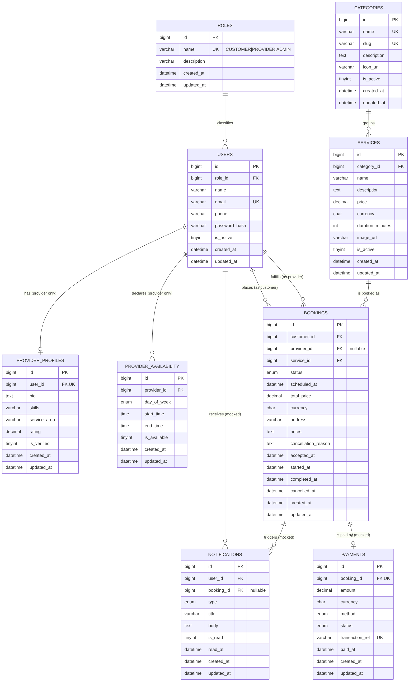

# Database

The **canonical source of truth** for the schema is the Sequelize migrations in
[`../backend/src/migrations`](../backend/src/migrations) and the seeders in
[`../backend/src/seeders`](../backend/src/seeders). The files here are convenience exports.

| File | Contents | Use |
|------|----------|-----|
| `schema.sql` | `CREATE TABLE` DDL for all tables (no data) | Inspect the schema, or bootstrap an empty DB without the ORM |
| `servicehub-with-seed.sql` | Schema **+ seed data** (roles, sample users, catalog, bookings) | One-shot import of a ready-to-demo database |
| `erd.png` / `erd.svg` | Rendered entity-relationship diagram | Visual overview of tables + relationships |
| `erd.mmd` | Mermaid source for the ERD | Re-render with `mmdc -i erd.mmd -o erd.svg` |

## Entity-relationship diagram



Nine tables: `roles`, `users`, `provider_profiles`, `provider_availability`, `categories`,
`services`, `bookings`, `payments`, `notifications`.

> `schema.sql` includes Sequelize's `SequelizeMeta` migration-tracking table. Seeded passwords are
> bcrypt hashes of the documented demo passwords (see the root README → Sample credentials).

## Recommended setup (via the ORM)
```bash
cd ../backend
npm run db:migrate   # build the schema from migrations
npm run db:seed      # insert seed data (hashes passwords at runtime)
```

## Alternative (raw SQL import)
```bash
mysql -u root -p -e "CREATE DATABASE servicehub"
mysql -u root -p servicehub < servicehub-with-seed.sql
```

The rendered entity-relationship diagram is [`erd.png`](erd.png) (source: [`erd.mmd`](erd.mmd)).
Per-column definitions are the Sequelize models + migrations in `../backend/src/models` and
`../backend/src/migrations`.
